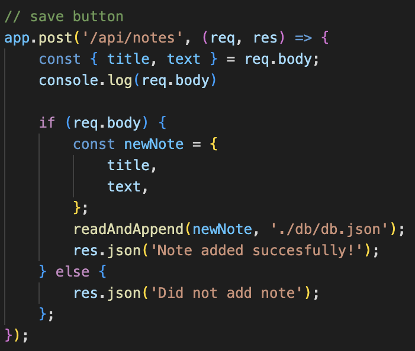
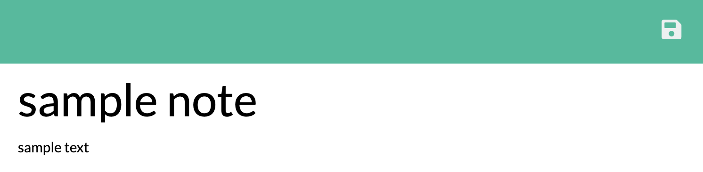

# Note Taker

## Table of Contents
1. [Description](#description)
2. [Visuals](#visuals)
3. [Installation](#installation)

## Description

Upon opening the website, you are greeted with a welcome page. When you press the Get Started button you are presented with an empty text box and a sample note to the left. When you fill out the title and text boxes, and save icon appears in the top right. When you hit the save button it saves the data and appears on the right hand side. When you click a specific note, it shows back up in the main text area. When you click the plus in the top right hand side, it empties the note page to allow you to write a new note.

## Visuals

This code is for the save button to save the data and write it in JSON format to the file db.json.

This is an example of the save button showing up after filling in the text bodies.

## Installation
To run this program, you must clone the repo, and then in the console install all the npm dependencies.